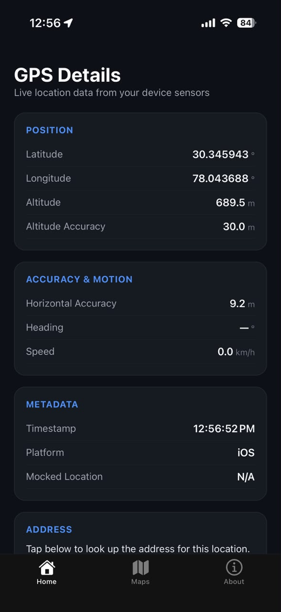
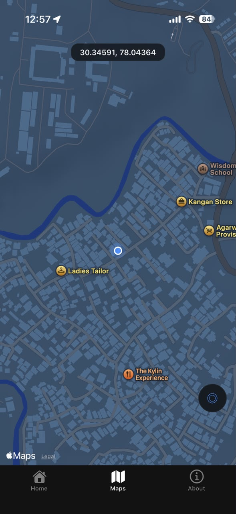
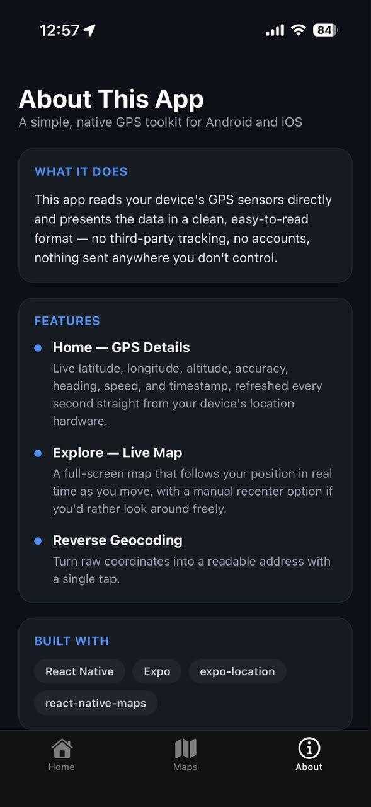

# 📍 GPS Toolkit

A lightweight, cross-platform mobile app built with **React Native** and **Expo** that reads your device's GPS sensors directly and displays live location data with a clean, native UI — no third-party tracking, no accounts, nothing sent anywhere you don't control.

Runs natively on both **iOS** and **Android**.

---

## 📱 Screenshots

<p align="center">
  
  
  
</p>

<p align="center">
  <em>Home — GPS Details &nbsp;|&nbsp; Explore — Live Map &nbsp;|&nbsp; About</em>
</p>

---

## ✨ Features

### 🏠 Home — GPS Details
Live latitude, longitude, altitude, altitude accuracy, horizontal accuracy, heading, speed, and timestamp — refreshed every second straight from your device's location hardware. Includes on-demand reverse geocoding to resolve coordinates into a readable address.

### 🗺️ Explore — Live Map
A full-screen map that follows your position in real time as you move, with a custom heading-aware marker and a manual recenter button if you'd rather pan around freely.

### ℹ️ About
App overview, feature summary, and developer info.

---

## 🛠️ Built With

- [React Native](https://reactnative.dev/)
- [Expo](https://expo.dev/) (Expo Router)
- [expo-location](https://docs.expo.dev/versions/latest/sdk/location/)
- [react-native-maps](https://github.com/react-native-maps/react-native-maps)
- [react-native-safe-area-context](https://github.com/AppAndFlow/react-native-safe-area-context)

---

## 🚀 Getting Started

### Prerequisites

- [Node.js](https://nodejs.org/) (LTS recommended)
- [Expo Go](https://expo.dev/go) app on your physical device, **or** Android Studio / Xcode for a simulator/emulator
- npm 10.x or 11.x (npm 12.0.x has a known bug with `create-expo-app`'s dependency resolution — downgrade if you hit JSON parsing errors during setup)

### Installation

```bash
# Clone the repository
git clone https://github.com/<your-username>/<your-repo>.git
cd <your-repo>

# Install dependencies
npm install

# Start the development server
npx expo start
```

Scan the QR code with the **Expo Go** app (Android) or your **Camera app** (iOS) to run it on your physical device, or press `a` / `i` in the terminal to launch an Android/iOS emulator.

> **Note:** If your Expo Go app from the App Store shows an "incompatible SDK version" error, install the matching SDK build from [sign.expo.dev](https://sign.expo.dev) instead.

### Permissions

This app requires **location access** to function. On first launch, you'll be prompted to grant permission — both the Home and Explore screens will show a "Grant Permission" prompt if it's denied.

---

## 📂 Project Structure

```
app/
├── (tabs)/
│   ├── index.tsx      # Home — GPS details screen
│   ├── explore.tsx    # Explore — live map screen
│   ├── about.tsx       # About screen
│   └── _layout.tsx    # Tab navigation layout
├── _layout.tsx
└── modal.tsx
components/
assets/
```

---

## 👨‍💻 Developer

**Akshay Upadhayay**
Software Development Engineer — 4+ Years of Experience

Built and maintained as a personal project exploring native device APIs with React Native and Expo.

---

## 📄 License

This project is open source. Feel free to fork it, learn from it, or build on top of it.